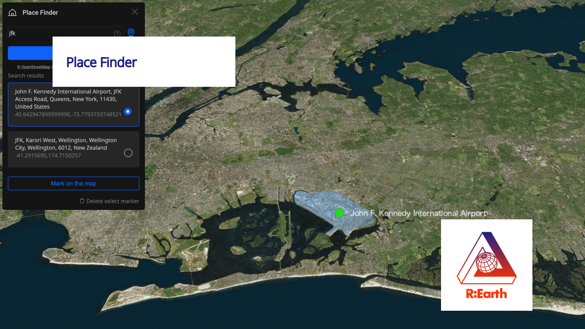
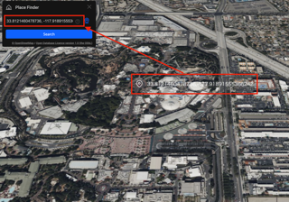

# Place Finder plugin

[©️ OpenStreetMap](https://www.openstreetmap.org/copyright) /  [Open Database Licence version 1.0 (the ODbL)](https://opendatacommons.org/licenses/odbl/)

## About this plugin

- This plugin allows you to find place by name, and vice versa. When you search by name, you'll get three types of results, point, line and polygon. The point indicate a specific place like building, the line indicate like a road and the polygon indicate area like town, city, state, etc. When you search by coordinates, you can specify place by clicking map then you can get the information of the place.
　
## Settings

### Style settings
You can change style of search result with right panel menu. The menu is categorized by result type as below.

   

### Result language settin

You can select one of the threes languages for result as below. 

- English / Japanese / Spanish

   

### Marker style setting

- You can place a Icon or a Point on the result.

   

   - Icon sample

   

   - Point sample
 
   

## Operation

### Search by name

Input search text in search box and click "Search" button then you'll get search result.

- Search result of "Tokyo Skytree." The result is "Point" type.
 
   

- Search result of "Tokyo, Shinjuku." The result is "Polygon" type. It indicate the Shinjuku district of Tokyo. If you click "Mark on the map" button, you can place a Icon or a Point on the map.
 
   

- Search result of "Colorado River." The result is "Line" type. 
 
   

### Search by coordinates

- Click the "Marker" icon.

   

- Click on the map then you'll get the coordinates of the place.

   

- Click the "Search" button, then you'll get search result.

   

## Test condition
  - OS:Mac OS Montery 12.6.5
  - Browser：Google Chrome 117.0.5938.132

## License
This plugin utilizes [Nominatim API of OpenStreetMap](https://nominatim.openstreetmap.org) so please read terms and condition when you use it. 
[©️ OpenStreetMap](https://www.openstreetmap.org/copyright) /  [Open Database Licence version 1.0 (the ODbL)](https://opendatacommons.org/licenses/odbl/)
